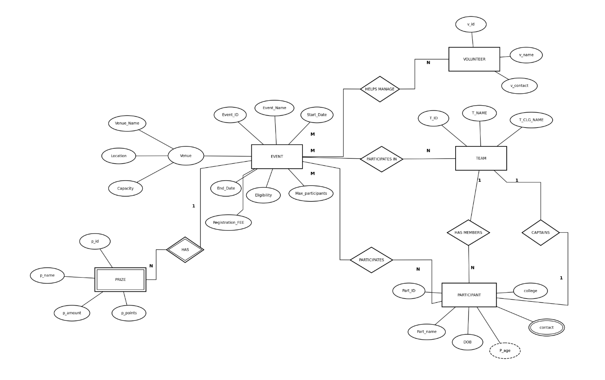

# The Bulletin Board

The Bulletin Board is a campus event website backed by a MySQL database. This project focuses on designing a relational schema for events, participants, teams, volunteers, and prizes, then using SQL joins, constraints, and queries to work with that data.

## Database design

The database is named `CollegeEventDB`. Its schema is defined in [`backend/tables.sql`](backend/tables.sql), with sample records and example SQL in [`backend/queries.sql`](backend/queries.sql).

| Table | Purpose |
| --- | --- |
| `Event` | Event details, dates, fees, capacity, venue, and external registration link. |
| `User_Event` | Events added through the website, including an owner identifier for edit and delete operations. |
| `Participant` | Student details and their associated team. |
| `Team` | Participating teams and captain reference. |
| `Volunteer` | Volunteer details. |
| `Prize` | Prizes associated with events. |
| `Participates` | Links participants to events. |
| `Team_Participates` | Links teams to events. |
| `Helps_Manage` | Links volunteers to events they manage. |
| `Participant_Contact` | Stores one or more contact numbers per participant. |

Primary keys identify each record. Foreign keys connect related records, while composite keys in the junction tables prevent duplicate event-participant, event-team, and event-volunteer relationships.

## SQL examples

`backend/queries.sql` demonstrates:

- Joining events with their participants, teams, and volunteers.
- Counting participants and volunteers per event.
- Calculating average fees and total prize amounts.
- Finding events with above-average fees and participants in multiple events.
- Using a subquery to find the event with the highest prize.

## MySQL and the website

The Python API reads event records from MySQL and supports adding, editing, and deleting website-created events. Registration links point to external forms; participant registration is not stored by the application. Sample event links use `example.com` placeholders and should be replaced with real URLs for a live deployment.
